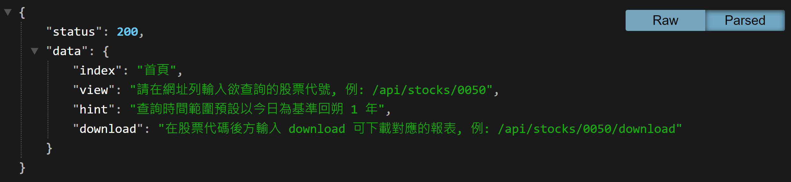
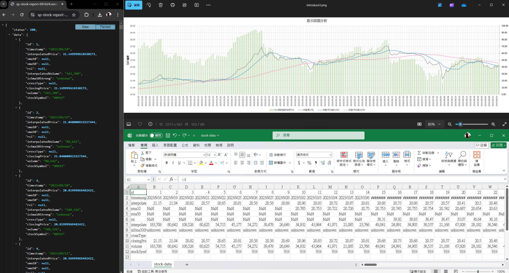
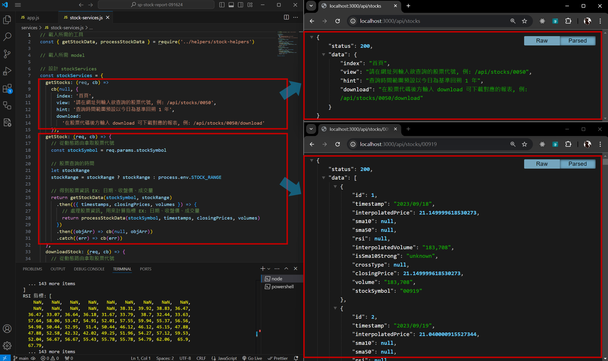

# 股市訊號分析網

## 介紹

- 此專案使用 Node.js/Express 打造後端 API, 讓使用者查詢特定股票代號, 並提供該股票過去一年的歷史收盤價
- 本專案串接 Yahoo Finance 後端 API, 提供即時及歷史的財務數據
- 根據歷史收盤價, 本專案計算並提供 10 日平均線、50 日平均線, 以及相對強弱指數 (RSI) 的推估分析
- 使用者可透過 download 路由下載本站整理的數據報表
- 備註: 十日平均線是根據包含當日的前 10 個交易日的收盤價計算, 因此前 9 筆資料設定顯示為 NaN。同理, 五十日平均線和 RSI 指數則分別參考前 50 個交易日和前 14 個交易日（不含當日）進行計算。在此期間, 由於資料不足而顯示 NaN, 屬正常現象

## 網站互動

您可以透過瀏覽器直接與本專案提供的 API 功能進行互動：
[WEB API](https://sp-stock-report-091624.onrender.com/)

## 本地測試

- 請在本機安裝 Node.js 與 npm 套件管理系統
- 假設使用 Visual Studio Code, 建議先打開編譯器: Bash 指令 `code .` 在 `Terminal` 切換 node 版本
- 本專案採用 Node.js v14.16.0 進行開發, 請確認版本的一致性: Bash 指令 `node -v, nvm install 14.16.0, nvm use 14.16.0`
- 複製專案到本機: Bash 指令 `git clone https://github.com/cyanshub/sp-stock-report-091624.git`
- 進入專案資料夾: Bash 指令 `cd sp-stock-report-091624`
- 安裝套件: Bash 指令 `npm install`
- 確認套件齊全(可參考下方開發工具)
- 建立 .env 檔案並填入相關資料(可參考 `.env example` 文件): Bash 指令 `touch .env`
- 啟動專案: Bash 指令 `npm run start`; 或使用 nodemon 進行開發, Bash 指令 `npm run dev`
- 看到 `The App is listening on: http://localhost:3000` 可至瀏覽器輸入訊息提供網址打開網頁

## 開發工具

### 依賴項目 (Dependencies)

- axios: 1.7.2
- cors: 2.8.5
- csv-parser: 3.0.0
- dotenv: 10.0.0
- express: 4.17.1
- express-handlebars: 5.3.3
- fs: 0.0.1-security
- method-override: 3.0.0
- moment: 2.30.1
- moment-timezone: 0.5.45
- technicalindicators: 3.1.0

### 開發依賴項目 (Dev Dependencies)

- nodemon: 2.0.12
