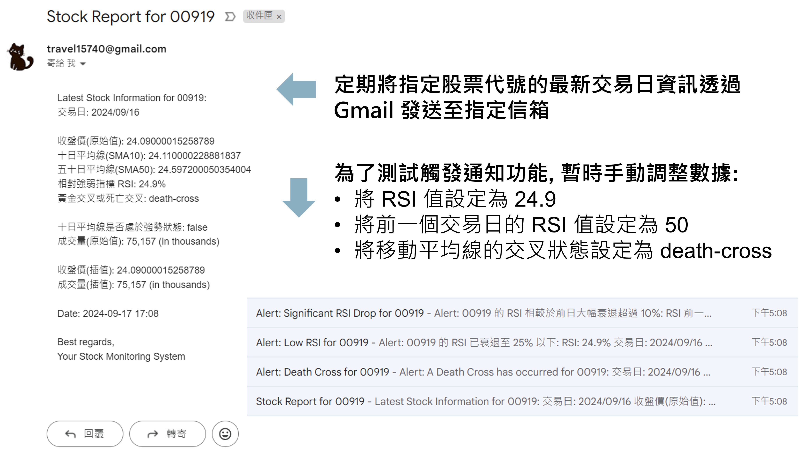

# 股市訊號分析網

## 介紹

- 此專案使用 Node.js/Express 打造後端 API, 讓使用者查詢特定股票代號, 並提供該股票過去一年的歷史收盤價
- 本專案串接 Yahoo Finance 後端 API, 提供即時及歷史的財務數據
- 根據歷史收盤價, 本專案計算並提供 10 日平均線、50 日平均線, 以及相對強弱指數 (RSI) 的推估分析
- 使用者可透過 download 路由下載本站整理的數據報表

- 備註 1: 有時候 Yahoo Finance API 可能會暫時回傳 null 值, 當遇到這種情況時, 系統會使用滾動平均插值法來推算缺失的數據。具體來說, 系統會根據缺失值前後三個交易日的數據進行估算。在回傳結果中, 我們提供了兩種收盤價: 推估收盤價 (interpolatedPrice) 和原始收盤價 (closingPrice)。若原始收盤價為 null, 系統將使用推估收盤價來計算相關指標及移動平均線; 若原始收盤價有值, 則會直接採用 Yahoo Finance 回傳的數據進行估算

- 備註 2: 十日平均線是根據包含當日的前 10 個交易日的收盤價計算, 因此前 9 筆資料設定顯示為 NaN。同理, 五十日平均線和 RSI 指數則分別參考前 50 個交易日和前 14 個交易日（不含當日）進行計算。在此期間, 由於資料不足而顯示 NaN 屬正常現象

## 定期排程與信件通知功能

本專案結合 **cronjob** 定時排程與 **nodemailer** 電子郵件服務, 實現股票市場監控功能。透過 **Gmail** 發送通知, 系統會將最新一個交易日的股票資訊自動發送至指定的使用者信箱

### 主要功能

- **定時排程**: 應用 cronjob 進行定期執行, 監控並發送最新股票資訊
- **股票資訊通知**: 系統會定期將所指定的股票代號的最新交易日資訊透過 Gmail 發送至指定信箱
  

### 事件通知

系統設計了多種常見的市場事件, 並能根據事件觸發通知:

- **黃金交叉與死亡交叉**: 當移動平均線發生黃金交叉或死亡交叉時, 系統會發送通知提醒使用者
- **RSI 事件通知**:
  - 當 RSI 低於設定的閾值時, 系統會發送「RSI 相對低點」通知
  - 當 RSI 發生大幅下降（超過設定的百分比, 預設為 10%）時, 系統會發送通知提醒使用者

### 使用技術

- **cronjob**: 定時排程管理
- **nodemailer**: 電子郵件發送工具, 與 Gmail 整合
- **技術指標監控**: 系統監控移動平均線的黃金交叉、死亡交叉、RSI 等技術指標, 並根據設置觸發對應的通知

### 本專案如何計算相對強弱指數 (RSI)？

**定義**：相對強弱指數是一種常見的技術指標, 用來判斷市場是否超買或超賣。RSI 通常使用 14 天的收盤價來計算市場的動能變化, 以此來衡量市場的強弱趨勢

**計算步驟**：

- **STEP 1**: 計算收盤價的每日上漲值與下跌值

- **STEP 2**: 在 14 天以內, 計算初始的平均上漲值和平均下跌值

  - 初始平均上漲值 = （前 14 天內的上漲總和）/ 14
  - 初始平均下跌值 = （前 14 天內的下跌總和）/ 14

- **STEP 3**: 從第 15 天開始, 使用以下公式更新平均值:

  - 平均上漲值 = （前一日平均上漲值 × 13 + 今日上漲值）/ 14
  - 平均下跌值 = （前一日平均下跌值 × 13 + 今日下跌值）/ 14

- **STEP 4**: 計算相對強弱 RS (Relative Strength, 相對強弱):

  - RS = 平均上漲值 / 平均下跌值

- **STEP 5**: 根據相對強弱計算 RSI:
  - RSI = 100 - (100 / (1 + RS))

**應用**:

- 當 RSI > 70 時, 市場可能處於超買狀態, 表示價格上漲過快, 隨時可能面臨回調
- 當 RSI < 30 時, 市場可能處於超賣狀態, 價格可能因過度下跌而有反彈的機會

## 網站互動

您可以透過瀏覽器直接與本專案提供的 API 功能進行互動:
[WEB API](https://sp-stock-report-091624.onrender.com/)

### 建議安裝 JSON 美化工具

為了更方便查看 API 返回的 JSON 資料, 建議您在瀏覽器中安裝 JSON 美化工具。以下是不同瀏覽器的推薦擴充套件:

- **Safari**: [JSON Peep](https://apps.apple.com/us/app/json-peep-for-safari/id1458969831?mt=12) (僅適用於 macOS)
- **Google Chrome**: [JSON Formatter](https://chromewebstore.google.com/detail/json-formatter/bcjindcccaagfpapjjmafapmmgkkhgoa)
- **Firefox**: [JSON Lite](https://addons.mozilla.org/zh-TW/firefox/addon/json-lite)
- **Edge**: [JSON Viewer Pro](https://microsoftedge.microsoft.com/addons/detail/json-formatter/dohcbdfhklpbkbljhccjbbmcmeekaakm)

您可以安裝對應的擴充套件來更方便地查看 API 返回的 JSON 資料

## 本地測試

- 請在本機安裝 Node.js 與 npm 套件管理系統
- 假設使用 Visual Studio Code, 建議先打開編譯器: Bash 指令 `code .` 在 `Terminal` 切換 node 版本
- 本專案採用 Node.js v14.16.0 進行開發, 請確認版本的一致性: Bash 指令 `node -v, nvm install 14.16.0, nvm use 14.16.0`
- 複製專案到本機: Bash 指令 `git clone https://github.com/cyanshub/sp-stock-report-091624.git`
- 進入專案資料夾: Bash 指令 `cd sp-stock-report-091624`
- 安裝套件: Bash 指令 `npm install`
- 確認套件齊全(可參考下方開發工具)
- 建立 .env 檔案並填入相關資料(可參考 `.env example` 文件): Bash 指令 `touch .env`
- 啟動專案: Bash 指令 `npm run start`; 或使用 nodemon 進行開發, Bash 指令 `npm run dev`
- 看到 `The App is listening on: http://localhost:3000` 可至瀏覽器輸入訊息提供網址打開網頁

## 開發工具

### 依賴項目 (Dependencies)

- axios: 1.7.2
- cors: 2.8.5
- csv-parser: 3.0.0
- dotenv: 10.0.0
- express: 4.17.1
- express-handlebars: 5.3.3
- fs: 0.0.1-security
- method-override: 3.0.0
- moment: 2.30.1
- moment-timezone: 0.5.45
- node-cron: 3.0.3,
- nodemailer: 6.9.14,
- technicalindicators: 3.1.0

### 開發依賴項目 (Dev Dependencies)

- nodemon: 2.0.12
